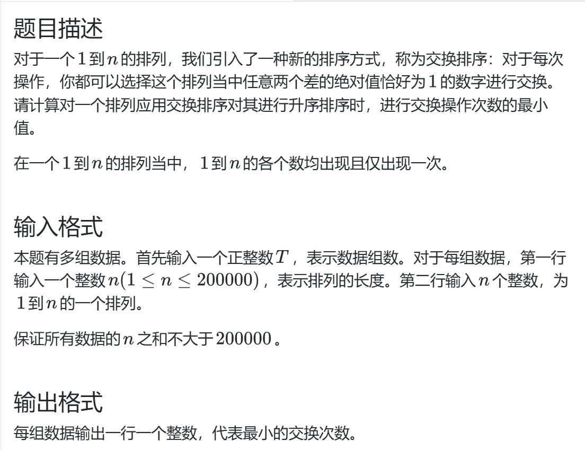
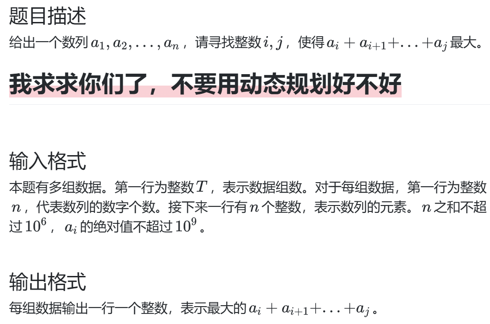

# 分治策略
分治，分而治之  

1.把原问题分解、重构为较小的情况，分别解决、合并

2.二分也是分治的一种，在解决问题时分解区间，排除不可能的区间，从而减小问题规模、逼近答案


## 交换排序

### 数学建模
关于线性代数概念逆序对：如果 `a[i] < a[j] && i > j`,则称其为一个逆序对，在交换排序中，只能交换相邻的数字，因此*每次交换只能减少逆序对的数量为1*，
这样，问题就变为了如何统计 `arr`中的逆序对
### 算法选择
1.暴力遍历，显然 `O(n^2)`

2.考虑在归并排序的同时计数逆序对 `O(nlogn)`
```c++
 int i=0,j=0;
    int l1=arr1.size(),l2=arr2.size();
    while(i!=l1&&j!=l2) {
        if(arr1[i]<=arr2[j]) {
            ans.push_back(arr1[i]);
            i++;
        }else {
            ans.push_back(arr2[j]);
            j++;
            //此时满足逆序对的定义，并且arr1[i]之后的元素都与arr2[j]构成逆序对
            cnt+=l1-i;
        }
    }
```
## 最大连续和

### Way1 分治思想 O(nlogn)
把问题分解为三种情况：跨越mid,mid左，mid右,再比较最大连续值，其中mid左/右可以递归完成


### Way2 动态规划
• 属于最优化问题（求最大值）

• 具有重叠子问题特性：不同位置的最大子数组计算存在重复

• 满足最优子结构：整体最优解包含子问题最优解

**关键突破点：改变视角**

• 传统思路：考虑子数组的起始位置（导致O(n²)）

• 创新视角：考虑以每个位置结尾的子数组

• 定义子问题：**dp[i] = 以arr[i]结尾的最大子数组和**


建立状态转移方程:  
`dp[i] = max(dp[i-1] + arr[i] , dp[i])`

```c++
ll maxsum_plus(vector<ll> arr) {
    if (arr.empty()) return 0;
    
    ll current = arr[0];  // 当前子数组和
    ll max_sum = arr[0];  // 全局最大和
    
    for (int i = 1; i < arr.size(); ++i) {
        // 选择：从当前元素重新开始 或 加入之前的子数组
        current = max(arr[i], current + arr[i]);
        // 更新全局最大值
        max_sum = max(max_sum, current);
    }
    return max_sum;
}
```
## L
考虑图形对称性，简化对称情况的处理思路

**符号书写要清楚，>= / >**

测试点编写要考虑很多情况，奇数偶数、边界、数据
## 画圆

这道题的分治思想体现于使用二分答案的思想  
对于圆的半径R，我们设定一个初始范围 `[0,1e14]`,自定义循环次数  
关键在于如何判定此时的R是否符合  
这是一个数学问题，对于圆 `(a,R)`,点 `(x,y)` 在圆内的条件是 `(a-x)^2 + (R-y)^2 <= R^2`,我们可以求出此时 `a` 的
一个范围，对比所有点的范围，如果区间左端的最大值小于等于区间右端的最小值，即这个R可以满足条件

## 总结
1.数据类型选择 `ll`  `ld`

2.想让函数具有一定有益的副作用，例如完成指定返回的同时改变某些值，就可以 **把变量引用作为参数传入函数**

3.**在维护临时比较值的时候，要分清什么时候改变，什么时候回溯**

4.对于精度输出：
```c++
 cout << fixed << setprecision(10) << ans;
```
5.符号书写要清楚，>= / >

6.测试点编写要考虑很多情况，奇数偶数、边界、数据