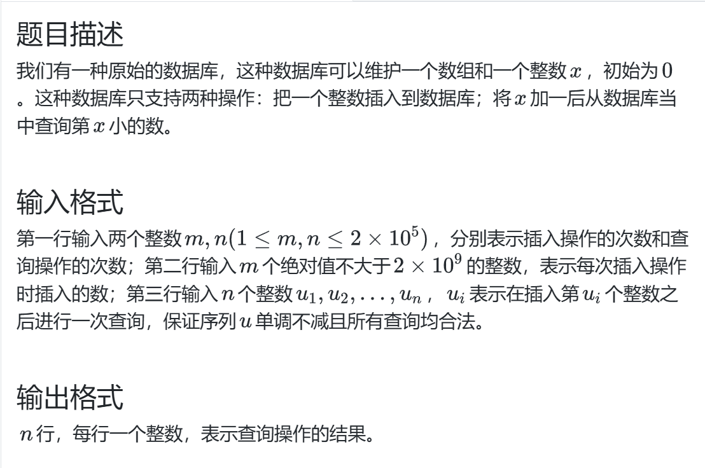
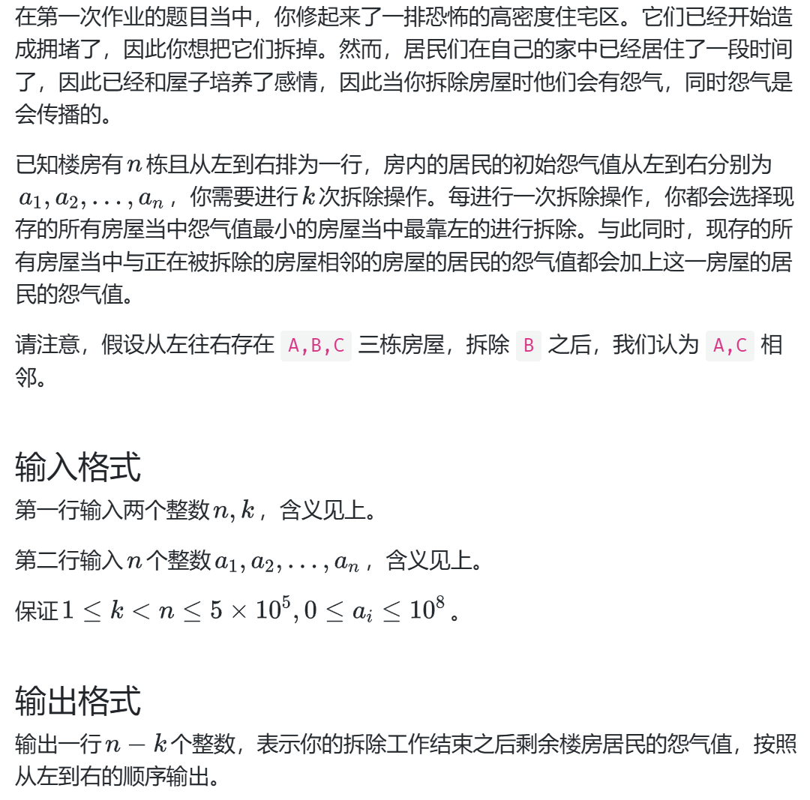
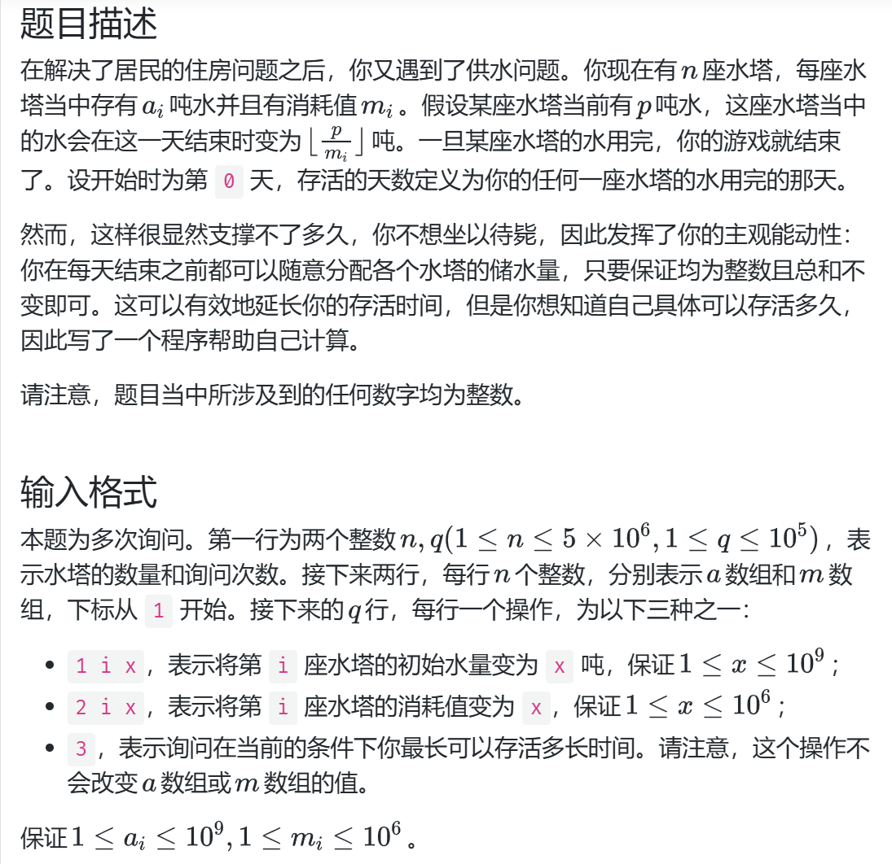

## 最小堆
当结构体成员变量中含有数组时,如何在声明时初始化：
```c++
struct MyData {
    int id;
    vector<int> vals;

    MyData(int id_, int n, int init = 0) : id(id_), vals(n, init) {}
};
```
## 原始数据库

### 难点分析
1.本题中所有的查询的位次 `x` 是连续递增的，而不是随机查询

*这种特殊的描述往往意味着特殊的处理思路*

本题中，我们考虑**能否维护前 x 个较小的元素，返回时查询最大的即可**
使用 *对顶堆* 的结构解决 `第 x 小的数问题`
## city_skyline2

### 难点分析
1.可变最值模型解决当前怨气最小的房屋以及怨气的变化

2.采用链表维护左右相邻的结构 

*链表指向的并非真实的节点，而是记录编号，避免复杂的指针操作*
### 易错点分析
1.避免大量使用堆空间分配，直接使用栈空间或者值传递性能更好，这也是为什么链表不使用指针的原因
## city_skyline3

### 难点分析
1.对于本题，我们的目标是把所有水量尽可能多地分配给消耗最小的那一个，其他水塔只需要维持和消耗量一样即可，
这样，每天减少的水是最少的

2.对于多次查询问题，其时间优化要考虑 **不同查询间的重复操作能否优化**，对于本题，维护一个最小消耗量的水塔并且能随时更改，也即
**“可变最值模型”**  

3.日期计算函数的实现
```c++
ll cntday_plus(ll sumwater, ll sumconsume, ll minconsume, int n) {
    ll ans = 0;
    //每个m[i]都为1，则天数无穷
    if (sumconsume == n)return -1;
    //无法支撑第0天
    if (sumwater < sumconsume)return 0;
    if (minconsume == 1) {
        long long dec = sumconsume - n;  // 每天固定减少的水量
        return (sumwater - sumconsume) / dec + 1;
    }
    while (sumwater >= sumconsume) {
        ll temp = sumwater - (sumconsume - minconsume); //分配给最小消耗水塔的水
        //最小水塔剩余量，其他水塔剩余1
        temp /= minconsume;
        //更新总水量
        sumwater = temp + n - 1;
        ans++;
    }
   return ans;
}
```
一般情况下 除法while循环 为对数开销，在 *特殊情况`minconsume == 1`退化为线性时间* ，while
循环的开销将非常大，因此要特殊处理

### 易错点分析
1.当更换数据类型时，不要拉下某个变量

2.废弃元素的移除要在每次查询前进行，避免连续查询导致出错

3.评测机和本地结果不一样，可能是发生了未定义行为，例如本次变量未初始化就操作