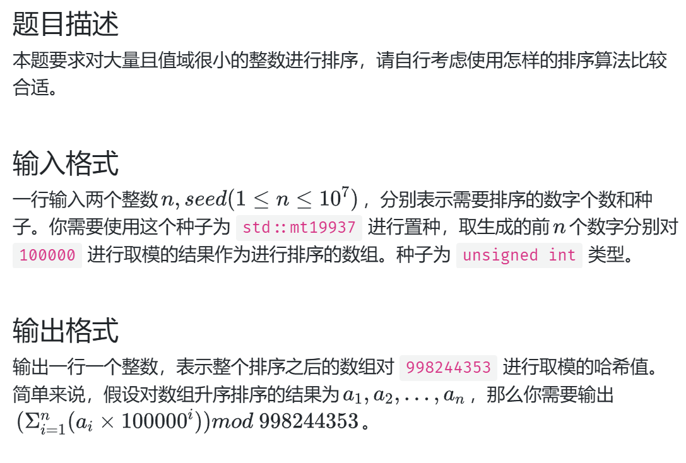
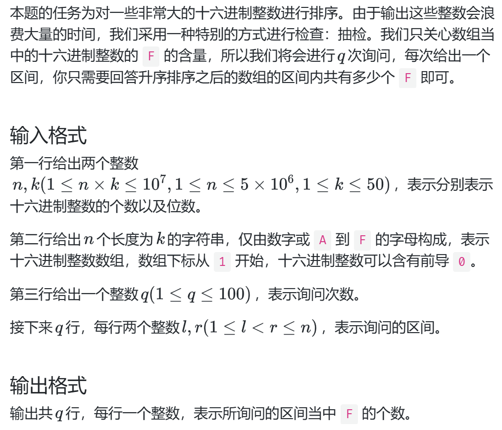
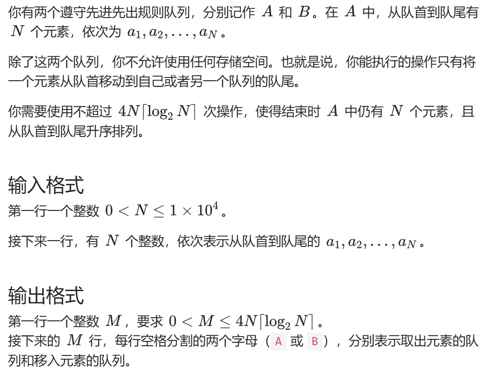

## 1e7 排序

### 难点分析
1.对大量且值域很小的整数进行排序-->计数排序

计数排序的时间复杂度为 𝑂(𝑛 +𝑤)
其中 𝑤 代表待排序数据的值域大小。

2.把元素全部放入桶中以后难点在于计算 `100000^arr[j]`,考虑 *避免重复计算* 原则，我们记忆前一次的`100000^arr[j]`，
下一次直接使用即可

3.含有取模的计算要频繁取，避免数据溢出
## 十六进制排序

### 难点分析
1.如何对16进制数进行排序

对于**位数确定的数据，可以采用 `基数排序` 法**，大致思路是：使用一种稳定的排序从低位向高位对数据排序，共排
n 次，时间复杂度 `O(n * k)`，此处**由于每位数字情况固定，也即值域很小，可以采用 `计数排序`**：统计每个数字的出现次数，再转为前缀和形式，也即
此数字在序列中的位次，为了保证排序稳定性，按上次排序后的顺序，从大到小排入新的位次，每排入一个，
当前前缀和就减1

2.时间复杂度之外的优化

把一行数据存为一维数组，再自定义下标计算符，对于数据敏感的题目可以大幅优化常数级时间

避免操作整个数据，例如复制移动整个字符串，用下标代替原数据结构，通过修改 `替代品` 优化时间
## 双队列排序

### 难点分析
1.如何使用和一般比较排序同样的时间复杂度完成任务，考虑使用双队列模拟归并排序

2.归并排序的方式并不唯一，不一定需要按照拆分再合并的思路进行，这样拆分时会产生大量的旋转操作，
导致时间复杂度常数过大，因此考虑新的归并方式（**变递归为迭代**）：从单个单元开始，将元素两两合并、四四合并...以此类推，直到完成排序

3.如何记录移动过程，**使用队列引用作为参数，通过比较地址确定是否为某个全局变量**，以完成记录
### 易错点分析
1.分组迭代时，注意考虑除不尽的情况，组数是否+1、什么时候改变上界、上界对应关系
