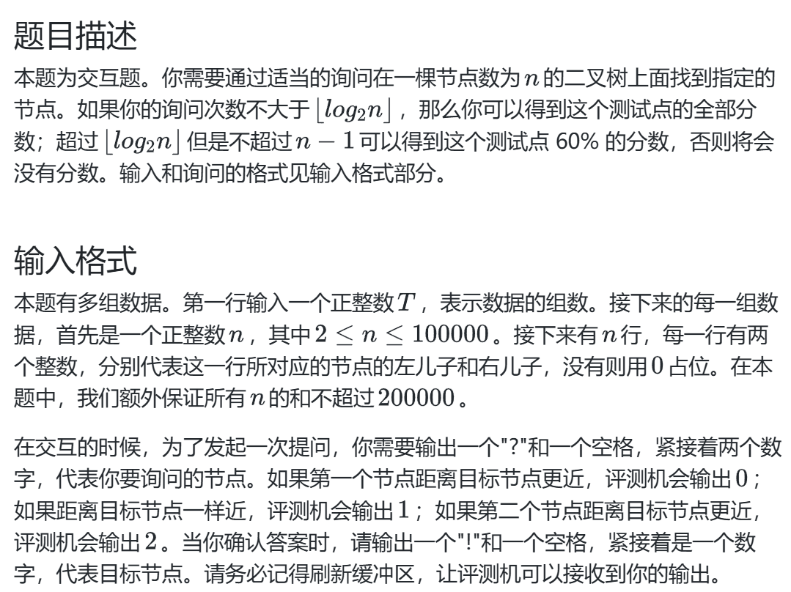

# 快速选择 树
## 修剪树木

### 难点分析
1.朴素的想法是从叶子节点开始，向上遍历来寻找和为 K 的子树，然后把这棵树删除，
但是删除时需要向上遍历修改根节点的前缀和，会消耗大量时间，因此需要更优的算法
```c++
ll count(int &cnt,const vector<node>& tree,int idx,int k) {
    if(idx == 0)return 0;
    int l = tree[idx].idxl;
    int r = tree[idx].idxr;
    ll sumleft = count(cnt,tree,l,k);
    ll sumright = count(cnt,tree,r,k);
    ll sum = sumleft + sumright + tree[idx].w;
    if(sum == k) {
        cnt++;
        return 0;
    }
    return sum;
}
```
用count函数计算当前根节点的权值和，使用 `后序遍历` 递归计算和  
巧妙之处在于：和为 K 时，我们删除这棵子树，也即 返回0

2.关键分析：**后续遍历可以用于递归计算权值和以及子树的和**
### 易错点分析
1.根节点需要自行判断，并不是默认的 1
## 链？ 菊花？

### 难点分析
1.观察查询次数限制 `ceil(n / 2) + 3` ,我们开始时要找一个边，并以此来分析是否是花
，但是不能依次遍历来找和 1 链接的节点，这样可能直接超限，因此我们要**把 1 - n 两两分组查询第一个边**

2.可能没有找到，还要分奇数偶数讨论

3.对于找到的情况，一般想法是判断 a,b哪一个是菊花的中心，但
`(query(1,firstlink)&&query(2,firstlink))||(query(1,firstlink+1)&&query(2,firstlink+1)`
最坏情况下需要查询 4 次，因此思考能否改进

4.当 `fl` 和 `h1` 链接但不和 `h2` 链接时，`fl` 不是 center，而由于 **树没有环** 的特性，
`fl + 1` 不能再和 `h1` 链接，退出即可，此时最坏情况恰为 `ceil(n / 2) + 3`
### 易错点分析
1.`cout` 输出时，不要忘记变量单独作为一栏，放在引号内就变成字符串了

## 宇宙飞船

### 难点分析
1.本题的难点在于元素的序号 `a` 是乱序的，朴素的想法 `先排序再使用前缀和遍历` 主要时间消耗在于排序的 `O(nlogn)`,分析时间可知复杂度不够优秀

2.对于快速选择的思路，优化的难点在于每次找到一个 `n_th` 元素时，如何检验它是否满足标准，如果每次都完全遍历，`二分位次+检验` 时间依旧是 `O(nlogn)`

3.如何优化第二个思路的关键在于 `避免检验时的完全遍历` ,由于本题的递归属于 `reduce and conquer`,我们可以维护 `exsumL` 和 `exsumR` 用于记录已经算过的、
不会再检验的元素，这样每次计算的规模都会缩小一半，也即：只需计算递归范围内的左右和，分别与 `exsumL` 和 `exsumR` 相加即可

4.算法分析：二分递归深度理论上是 `logn` ，每次都是 `O(n)`,但由于 `问题规模减小` ,实际上是 `n+n/2+n/4+...+1` 的规模，最终为 `O(n)`  
也即：复杂度不能简单用 `次数 * 每次的复杂度` 计算
### 易错点分析
库函数中使用随机访问迭代器为参数时，要注意 `左闭右开` 原则
## 二分二叉树

### 60分思路
从根节点开始，向下询问，根据远近选择左右分支，迭代进行

关键点：

1.要使用 `prev` 记录父节点，在更新时避免由于更新了 `left` 而误以为是原来的 `left` ，同时避免在输出时遇到 0 情况

2.对于每个情况需要返回、结束的情况要写清楚，以免分支结构混乱

3.初始化问题

4.对于只有一个节点的情况，不能简单认为就是二者之一，还可以向下寻找

5.虽然询问次数是 `树高` 复杂度，但对于 **退化为链的树** ，仍然不满足对数复杂度，还需要优化
### 100分思路
在掌握树的重心相关知识后，我们的思路就是在树的重心处询问，reduce 到其中一棵子树，这里很关键的一点在于：
询问次数是严格的，而非一个复杂度量级，因此我们需要 **在一次询问内把数量缩减到其中一棵子树**

关键点：

1.对于3节点的情况，我们询问 `l` 和 `r` ,当距离相等时，`reducetoPandG`,而不是再次询问

2.如何递归到父树？我们记录一个原始根节点，当需要递归到父树时，断开父节点和 `G` 的链接，并向上更新 `nNode` 节点和数组，
从原始根节点 `prevroot` 寻找 `G`