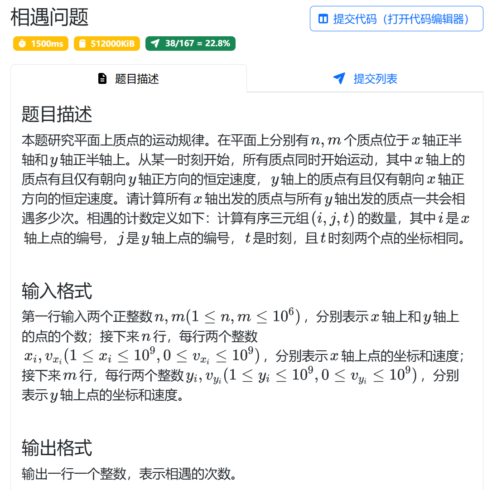
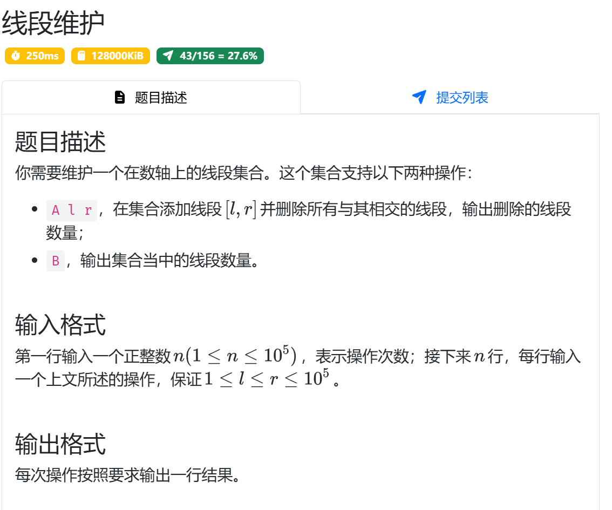

# BST 散列表
## 集合
自己构造哈希表，常用取模作为哈希函数，用链表解决哈希冲突，注意取模时要映射到正数范围
```c++
int hashf(ll x) {
        return (x % MOD + MOD) % MOD;
}
```
## 相遇问题


### 难点分析

相遇条件为 `x / vy == y / vx ==> x * vx == y * vy` ,因此**只需要找到相等的坐标速度之积**即可,把积作为 `{积，数量}` 存入hashmap
，遍历相乘即可
### 易错点分析
注意数据类型提升的陷阱

注意速度为 0 的边界情况

## 线段维护

### 难点分析
在插入一个新的线段之前当前所有线段没有重合，因此按 `l / r` 任意排序就是直观上的分布顺序，可以使用 `set` 维护这一顺序

对于新插入的元素，我们要找其第一个可能覆盖的线段，以按 `r` 排序为例：找到新线段的左端在集合中的位置，在此之前的线段都不可能与其重合，
从此迭代器开始检查即可，直到某个线段与其不再重合，之后的线段也不再重合

### 易错点分析
如果找新线段右侧在集合中的位置？

1.此时不能保证第一个线段与其不重合后，之前所有线段都不重合，因此直接循环可能会直接退出，因此**可以用数组暂存迭代器，最后统一消去**

2.找不到就意味着没有吗？不一定，此时要从检查集合是否为空集，如果不是，则从最后一位重新向前遍历
